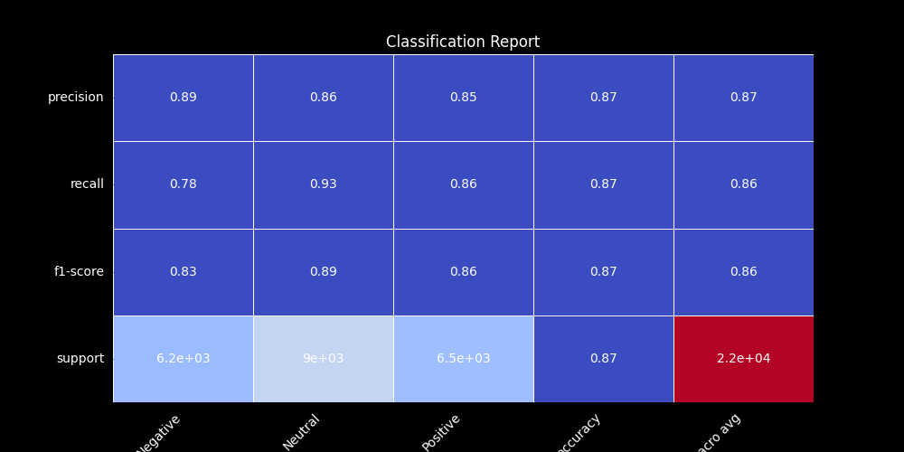
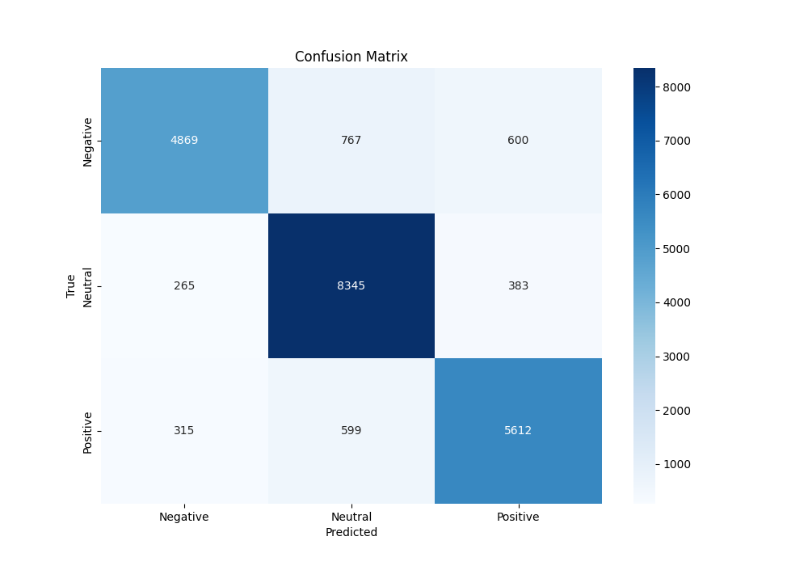

# News Sentiment Analysis

News Sentiment Analysis is a machine learning model that can effectively classify Sentiments of News text into negative , neutral , positive.

# Table of Contents

- [News Sentiment Analysis](#news-sentiment-analysis)
- [Table of Contents](#table-of-contents)
- [Brief Overview](#brief-overview)
- [Demo](#demo)
- [Installation](#installation)
- [Data Sources](#data-sources)
- [Model](#model)
- [Testing and Evaluation](#testing-and-evaluation)
- [Deployment](#deployment)

# Brief Overview
[(Back to top)](#table-of-contents)

The News Sentiment Analysis project involves building a machine learning model to classify news articles into positive, neutral, or negative sentiments. The project encompasses several key stages, including data collection, preprocessing, model training, evaluation, and deployment.

# Demo
[(Back to top)](#table-of-contents)

Here is a short demo of the deployed web application.

https://github.com/SanKolisetty/AI-Image-Classifier/assets/95172001/0ebe3ffb-4afe-4a7b-96d3-80ce5e7ce99f

# Installation
[(Back to top)](#table-of-contents)

Open Git Bash and change the directory to the location where the repository is to be cloned. Then, type the following commands.

```shell
  git init
```
```shell
  git clone https://github.com/anuj120377/News-Sentiment-Analysis.git
```

Now, Navigate into the project directory
```shell
  cd News-Sentiment-Analysis
```
Again,
```shell
  cd djangoNewsSentimentAnalysis
```
To access or use the application, run the following command.

```shell
python manage.py runserver
```
Finally,
Open your web browser and go to http://localhost:8000/ to view the News Sentiment Analysis application.


# Data Sources
[(Back to top)](#table-of-contents)

The dataset is comprised of News Texts. Texts were collected from Google using the Beautiful Soup. One dataset from kaggle was also used.
Employed Vader Sentiment for labeling, providing reliable sentiment scores to classify news articles into positive, neutral, or negative categories.


# Model
[(Back to top)](#table-of-contents)

The model for the News Sentiment Analysis project consists of embedding layer to convert words into vector representations, followed by dense layers to classify the sentiment as positive, neutral, or negative. It employs natural language processing techniques for preprocessing and is optimized for accurate sentiment prediction.

> The model architecture and model summary are uploaded.

# Testing and Evaluation
[(Back to top)](#table-of-contents)

On evaluation, model achieved an accuracy of 86.83% 

Classification Report:



Confusion Matrix:




# Deployment
[(Back to top)](#table-of-contents)

The application has been deployed in the Streamlit Cloud.

You can access it here: [https://ai-image-classifier-sk.streamlit.app/](https://ai-image-classifier-sk.streamlit.app/)
